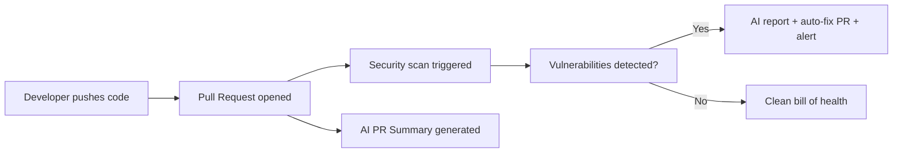
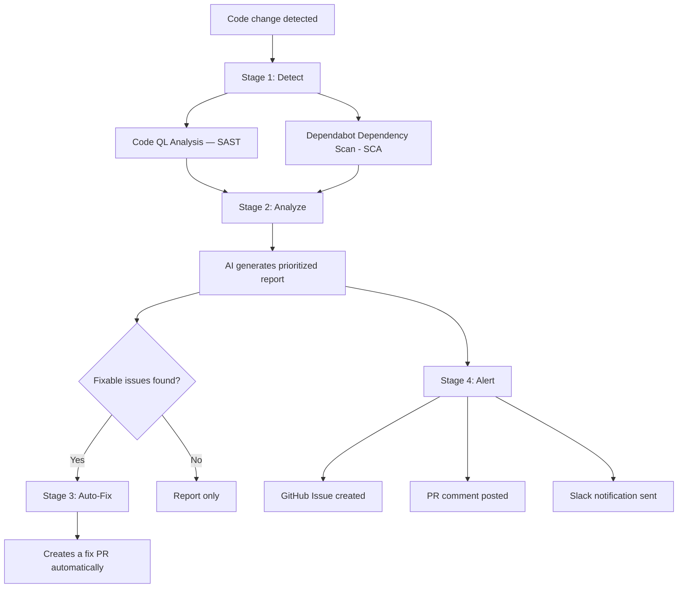

# AI-Powered DevOps Automation — Executive Summary

> **Important:** What you are seeing today is a **Proof of Concept (PoC)**. This demonstrates the capabilities and potential value of AI-powered automation in our development workflow. It is **not production-ready** and is not intended for immediate rollout. There is room for refinement, additional configuration, and planning before any implementation into live environments.

## What We Built

Two AI-powered capabilities that run automatically inside the development workflow — requiring zero additional effort from developers:

1. **Security Autofix Pipeline** — Continuously scans every code change for vulnerabilities, generates a prioritized report, auto-fixes what it can, and alerts the team immediately.
2. **AI Pull Request Summaries** — Automatically writes a clear description of every code change: what was modified, why it matters, and how to validate it.

---

## Why It Matters

| Challenge | How This Solves It |
|-----------|--------------------|
| Security vulnerabilities ship undetected | Every change is scanned automatically — issues are caught before they reach production |
| Fixing issues after deployment costs 10–100x more | Vulnerabilities are identified and remediated during development, not after |
| Compliance requires evidence of continuous scanning | Audit-ready reports are generated automatically on every change |
| Code reviewers lack context on what changed | AI writes a structured summary instantly — no waiting for developers to document |
| Manual security reviews are slow and inconsistent | Two scanning engines run in parallel on every change, every time, without exception |

---

## How It Works (at a Glance)

### Low-Level Diagram: Security Autofix Pipeline — Five Stages

| Stage | What Happens |
|-------|--------------|
| Detect | Scans code for insecure patterns AND checks all libraries against vulnerability databases |
| Analyze | Deduplicates findings, classifies by severity, feeds to AI for prioritization |
| Fix | Automatically creates a fix with dependency upgrades and corrections applied |
| Report | AI generates a structured security report with remediation guidance |
| Alert | Critical issues trigger notifications (PR comment, GitHub Issue, Slack) |

**AI PR Summary** generates a structured description including: summary of changes, business context, validation steps, and a changelog entry.

---

## Business Impact

| Metric | Before | After |
|--------|--------|-------|
| Security scan frequency | Ad-hoc or quarterly | Every code change + weekly |
| Time to fix known vulnerabilities | Days to weeks | Minutes |
| Time to understand a code change | 15–30 min per review | Seconds |
| Audit documentation | Manual, after the fact | Automatic, real-time |
| Developer effort required | Must run separate tools | Zero — runs in background |

---

## Key Benefits

- **Shift-left security** — Catch vulnerabilities during development, not after deployment
- **Continuous compliance** — Automatic audit trail on every change (SOC 2, FedRAMP, NIST)
- **Zero friction** — Developers change nothing about their workflow
- **Scalable** — Works the same for 5 developers or 500
- **Customizable** — AI behavior, report format, and alert thresholds are all configurable

---

## Data & Privacy

- AI runs through **GitHub Models API** — code stays within GitHub's infrastructure
- No code is stored or used for model training
- Subject to GitHub's enterprise data protection policies

---

## Next Steps

This PoC validates the concept. Before any production rollout, the following steps are needed:

- **Gather feedback** — Identify what resonates, what needs adjustment, and any concerns
- **Define scope** — Determine which repositories and teams would benefit first
- **Plan improvements** — Refine AI behavior, alert thresholds, and reporting format based on team input
- **Address prerequisites** — Ensure access, tokens, and permissions are in place (see Prerequisites document)
- **Plan rollout timeline** — Align on phased implementation schedule with DevOps & Accenture teams
- **Production hardening** — Review security, token management, and failure handling for production use

- Align on the next steps with DevOps Team & Accenture Team