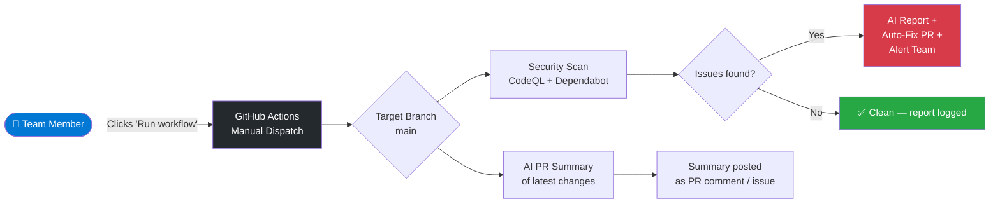
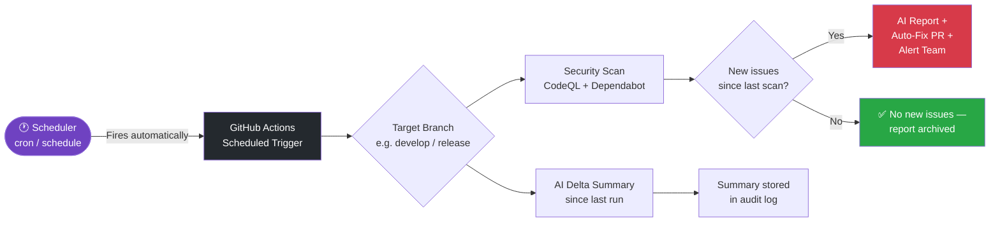
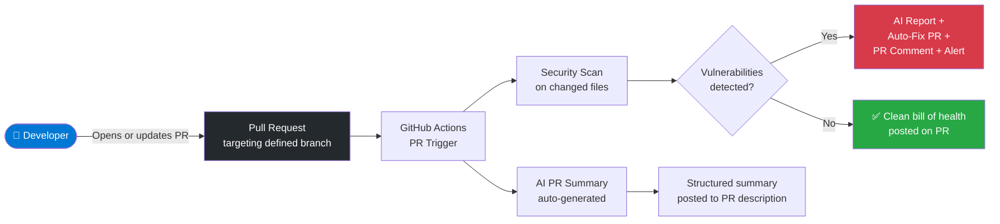
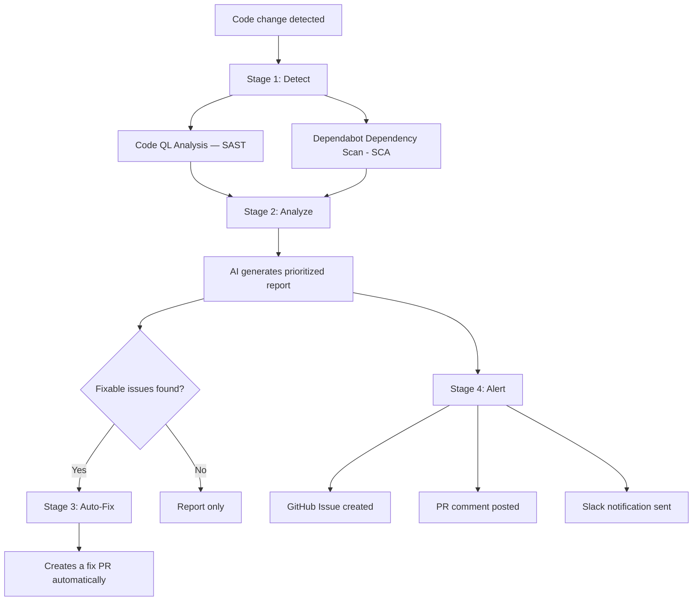

# AI-Powered DevOps Automation — Executive Summary

> **Important:** What you are seeing today is a **Proof of Concept (PoC)**. This demonstrates the capabilities and potential value of AI-powered automation in our development workflow. It is **not production-ready** and is not intended for immediate rollout. There is room for refinement, additional configuration, and planning before any implementation into live environments.

## Problem Statement

Many development teams still rely on processes that are manual, inconsistent, and difficult to scale.

- **Current-state challenge:** Code reviews are manual, security scans are ad hoc, and documentation is inconsistent.
- **Security risk:** Vulnerabilities are often discovered too late, increasing exposure and making remediation more expensive.
- **Review friction:** Reviewers do not always have clear context on what changed, why it changed, and how to validate it.
- **Compliance gap:** Teams struggle to produce consistent evidence that security checks are happening continuously.
- **Business impact:** These gaps lead to slower reviews, higher remediation cost, and greater operational risk.

Security issues are easier and cheaper to address during development than after release, but without automation, scanning and documentation depend too heavily on individual effort and timing.

## What We Built

Two AI-powered capabilities that run automatically inside the development workflow — requiring zero additional effort from developers:

1. **Security Autofix Pipeline** — Continuously scans every code change for vulnerabilities, generates a prioritized report, auto-fixes what it can, and alerts the team immediately.
2. **AI Pull Request Summaries** — Automatically writes a clear description of every code change: what was modified, why it matters, and how to validate it.

---

## Why It Matters

| Challenge | How This Solves It |
|-----------|--------------------|
| Security vulnerabilities ship undetected | Every change is scanned automatically — issues are caught before they reach production |
| Fixing issues after deployment costs 10–100x more | Vulnerabilities are identified and remediated during development, not after |
| Compliance requires evidence of continuous scanning | Audit-ready reports are generated automatically on every change |
| Code reviewers lack context on what changed | AI writes a structured summary instantly — no waiting for developers to document |
| Manual security reviews are slow and inconsistent | Two scanning engines run in parallel on every change, every time, without exception |

---

## How It Works — Trigger Modes

The automation supports three distinct trigger modes, each suited to different scenarios. All modes run the same Security Autofix Pipeline and AI PR Summary logic — only the entry point differs.

---

### Trigger 1 — Manual Run on Main Branch

> A team member or release manager manually kicks off the pipeline against the `main` branch — useful for on-demand audits, compliance checks, or before a major release.

| Step | Description |
|------|-------------|
| Trigger | Manually initiated via GitHub Actions "Run workflow" button |
| Branch | Targets `main` (configurable) |
| Output | Security report + auto-fix PR (if needed) + AI summary |
| Use case | Pre-release audit, compliance snapshot, ad-hoc security review |

---

### Trigger 2 — Automatic Scheduled Run on Defined Branch

> The pipeline runs automatically on a schedule (e.g., nightly or weekly) against a defined branch — ensuring continuous coverage even without any developer action.

| Step | Description |
|------|-------------|
| Trigger | Cron schedule (e.g., every night at midnight, every Monday) |
| Branch | Any defined branch — `develop`, `release/*`, `main` |
| Output | Security delta report + auto-fix PR (if new issues) + AI summary |
| Use case | Continuous compliance monitoring, zero-effort weekly audits |

---

### Trigger 3 — Incoming Pull Request on Defined Branch

> Every time a developer opens or updates a pull request targeting a defined branch, the pipeline fires automatically — catching issues before the code is merged.

| Step | Description |
|------|-------------|
| Trigger | PR opened, updated, or synchronized against a protected branch |
| Branch | Any configured target branch (e.g., `main`, `develop`) |
| Output | Security report + auto-fix PR + AI-written PR description |
| Use case | Standard development flow — every code change is reviewed before merge |

---

### Trigger Mode Comparison

| | Manual (Main) | Scheduled (Branch) | Incoming PR |
|---|---|---|---|
| **Who initiates** | Team member | Automated scheduler | Developer (via PR) |
| **When it runs** | On demand | Fixed schedule (cron) | Every PR open / update |
| **Primary use case** | Audit, pre-release | Continuous compliance | Day-to-day dev workflow |
| **AI PR Summary** | Latest changes on branch | Delta since last run | Changes in the PR |
| **Auto-Fix PR** | Yes, if issues found | Yes, if new issues | Yes, if issues found |
| **Alert sent** | Yes, on critical findings | Yes, on new critical findings | Yes, on critical findings |

---

### Low-Level Diagram: Security Autofix Pipeline — Five Stages

| Stage | What Happens |
|-------|--------------|
| Detect | Scans code for insecure patterns AND checks all libraries against vulnerability databases |
| Analyze | Deduplicates findings, classifies by severity, feeds to AI for prioritization |
| Fix | Automatically creates a fix with dependency upgrades and corrections applied |
| Report | AI generates a structured security report with remediation guidance |
| Alert | Critical issues trigger notifications (PR comment, GitHub Issue, Slack) |

**AI PR Summary** generates a structured description including: summary of changes, business context, validation steps, and a changelog entry.

---

## Business Impact

| Metric | Before | After |
|--------|--------|-------|
| Security scan frequency | Ad-hoc or quarterly | Every code change + weekly |
| Time to fix known vulnerabilities | Days to weeks | Minutes |
| Time to understand a code change | 15–30 min per review | Seconds |
| Audit documentation | Manual, after the fact | Automatic, real-time |
| Developer effort required | Must run separate tools | Zero — runs in background |

---

## Key Benefits

- **Shift-left security** : Catch vulnerabilities during development, not after deployment
- **Continuous compliance** : Automatic audit trail on every change (SOC 2, FedRAMP, NIST)
- **Zero friction** : Developers change nothing about their workflow
- **Scalable** : Works the same for 5 developers or 500
- **Customizable** : AI behavior, report format, and alert thresholds are all configurable

---

## Data & Privacy

- AI runs through **GitHub Models API** , code stays within GitHub's infrastructure
- No code is stored or used for model training
- Subject to GitHub's enterprise data protection policies

---

## Next Steps

This PoC validates the concept. Before any production rollout, the following steps are needed:

- **Gather feedback** : Identify what resonates, what needs adjustment, and any concerns
- **Define scope** : Determine which repositories and teams would benefit first
- **Plan improvements** : Refine AI behavior, alert thresholds, and reporting format based on team input
- **Address prerequisites** : Ensure access, tokens, and permissions are in place (see Prerequisites document)
- **Plan rollout timeline** : Align on phased implementation schedule with DevOps & Accenture teams
- **Production hardening** : Review security, token management, and failure handling for production use

- Align on the next steps with DevOps Team & Accenture Team
